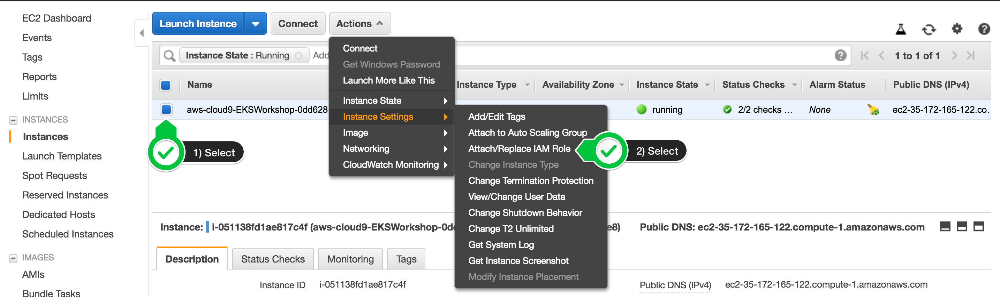

# Tech Talk - Kubernetes

**This is part of an Amazon ECS workshop at https://ecsworkshop.com**

Please visit https://ecsworkshop.com to learn more about Kubernetes on AWS

## AWS Login
After logging into the AWS Console from Okta's AWS - IT Dev tile, you need to elevate your role. Click on your email in the top-right and select `Switch Role`.

`insert picture here`

Use the following information when Switching Role
```
Account:        204451763192
Role:           assumable/developer
Display Name:   developer@itdev
```

## Set up Cloud9 IDE
---

### Set up your Username Variable
This will set up your username variable so you can just copy/paste the rest of the commands without worrying about filling in your username each time.

```bash
export USERNAME=helenes
echo "export USERNAME=${USERNAME}" >> ~/.bash_profile
```

### Install Kubernetes Tools
Amazon EKS clusters require kubectl and kubelet binaries and the aws-cli or aws-iam-authenticator binary to allow IAM authentication for your Kubernetes cluster.

Install kubectl
```bash
sudo curl --silent --location -o /usr/local/bin/kubectl https://storage.googleapis.com/kubernetes-release/release/v1.14.8/bin/linux/amd64/kubectl

sudo chmod +x /usr/local/bin/kubectl
```

Install JQ and envsubst
```
sudo yum -y install jq gettext
```

Verify the binaries are in the path and executable
```
for command in kubectl jq envsubst
  do
    which $command &>/dev/null && echo "$command in path" || echo "$command NOT FOUND"
  done
```

### Attach the IAM Role to your Workspace
Your Cloud9 instance needs permissions to access the AWS API for this demo. We need to  update the underlying EC2 instance to use a Instance Profile with the necessary permisisons. Find your EC2 instance (search for your username), then choose **Actions / Instance Settings / Attach/Replace IAM Role**



Search for "cloud9" in the list of profiles, and select the one that says `cloud9-instance-profile`

### Update IAM Settings for your Workspace
Cloud9 normally manages IAM credentials dynamically. This isn’t currently compatible with the EKS IAM authentication, so we will disable it and rely on the IAM role instead.


Also run this command to ensure temporary credentials aren't already in place:
```bash
rm -vf ${HOME}/.aws/credentials
```

Configure our AWS CLI with our current region:
```bash
export ACCOUNT_ID=$(aws sts get-caller-identity --output text --query Account)
export AWS_REGION=$(curl -s 169.254.169.254/latest/dynamic/instance-identity/document | jq -r '.region')

echo "export ACCOUNT_ID=${ACCOUNT_ID}" >> ~/.bash_profile
echo "export AWS_REGION=${AWS_REGION}" >> ~/.bash_profile
aws configure set default.region ${AWS_REGION}
aws configure get default.region
```

### Validate IAM Role
Run the command:
```bash
aws sts get-caller-identity
```

The output assumed-role name should contain
```
cloud9-instance-profile
```

Valid Output should be similar to this:
```json
{
    "Account": "204451763192", 
    "UserId": "AROAS7GSGKP4CN5WKQM5B:i-049ea2997a694ea1d", 
    "Arn": "arn:aws:sts::204451763192:assumed-role/cloud9-instance-role/i-049ea2997a694ea1d"
}
```

### Clone Microservices Repos
```bash
cd ~/environment
git clone https://github.com/helenes-r7/ecsdemo-frontend.git
git clone https://github.com/helenes-r7/ecsdemo-nodejs.git
git clone https://github.com/helenes-r7/ecsdemo-crystal.git
```

### Create an SSH key
Create the SSH key pair for your Worker nodes, in case you need SSH access to them.
```bash
ssh-keygen
```
> Press `enter` 3 times to take the default choices

Upload the public key to your EC2 region:

```bash
aws ec2 import-key-pair --public-key-material file://~/.ssh/id_rsa.pub --key-name "workshop-${USERNAME}"
```

## Deploy the Kubernetes Cluster
---
### Install eksctl
We need to download the eksctl binary:
```bash
curl --silent --location "https://github.com/weaveworks/eksctl/releases/download/latest_release/eksctl_$(uname -s)_amd64.tar.gz" | tar xz -C /tmp

sudo mv -v /tmp/eksctl /usr/local/bin
```

### Create an EKS Cluster
```bash
eksctl create cluster --nodes=3 --alb-ingress-access --region=${AWS_REGION} --name="eksworkshop-${USERNAME}"
```

>**Creating an EKS cluster can take over 10 minutes, so its a good time for a quick coffee and hallway conversation**

### Test the Cluster
Confirm your nodes are connected to the Kubernetes cluster
```bash
kubectl get nodes # if we see our 3 nodes, we know we have authenticated correctly
```

Export the Worker Role Name for later use
```bash
STACK_NAME=$(eksctl get nodegroup --cluster eksworkshop-${USERNAME} -o json | jq -r '.[].StackName')
INSTANCE_PROFILE_ARN=$(aws cloudformation describe-stacks --stack-name $STACK_NAME | jq -r '.Stacks[].Outputs[] | select(.OutputKey=="InstanceProfileARN") | .OutputValue')
ROLE_NAME=$(aws cloudformation describe-stacks --stack-name $STACK_NAME | jq -r '.Stacks[].Outputs[] | select(.OutputKey=="InstanceRoleARN") | .OutputValue' | cut -f2 -d/)
echo "export ROLE_NAME=${ROLE_NAME}" >> ~/.bash_profile
echo "export INSTANCE_PROFILE_ARN=${INSTANCE_PROFILE_ARN}" >> ~/.bash_profile
```

## Kubernetes Dashboard
---
### Deploy the Dashboard  
As a dashboard does not come with Kubernetes by default, we will deploy it now.


Deploy the dashboard with a single kubectl apply command:
```bash
kubectl apply -f https://raw.githubusercontent.com/kubernetes/dashboard/v1.10.1/src/deploy/recommended/kubernetes-dashboard.yaml
```

This is deployed to our private cluster, so we need to access it via a proxy. We will use Kube-proxy to proxy our requests to the dashboard service. In the workspace, run the command:
```bash
kubectl proxy --port=8080 --address='0.0.0.0' --disable-filter=true &
```
_We are disabling request filtering, a security feature that guards against XSRF attacks. This isn’t recommended for a production environment, but is useful for our dev environment._

### Access the Dashboard
1. In your Cloud9 environment, click **Tools / Preview / Preview Running Application**
1. Scroll to **the end of the URL** and append:
```bash
/api/v1/namespaces/kube-system/services/https:kubernetes-dashboard:/proxy/
```

Open a New Terminal Tab and run the command:
```bash
aws eks get-token --cluster-name "eksworkshop-${USERNAME}" | jq -r '.status.token'
```

Copy the output of this command and use it as the **Token** to _Sign In_


## Deploy Microservices
---


### Deploy NodeJS Backend

Deployment example:
```yaml
apiVersion: apps/v1
kind: Deployment
metadata:
  name: ecsdemo-nodejs
  labels:
    app: ecsdemo-nodejs
  namespace: default
spec:
  replicas: 1
  selector:
    matchLabels:
      app: ecsdemo-nodejs
  strategy:
    rollingUpdate:
      maxSurge: 25%
      maxUnavailable: 25%
    type: RollingUpdate
  template:
    metadata:
      labels:
        app: ecsdemo-nodejs
    spec:
      containers:
      - image: brentley/ecsdemo-nodejs:latest
        imagePullPolicy: Always
        name: ecsdemo-nodejs
        ports:
        - containerPort: 3000
          protocol: TCP
```
In the above example, we describe the service and _how_ it should be deployed

```bash
cd ~/environment/ecsdemo-nodejs
kubectl apply -f kubernetes/deployment.yaml
kubectl apply -f kubernetes/service.yaml
```

We can watch the progress by looking at the deployment status:
```bash
kubectl get deployment ecsdemo-nodejs
```

### Deploy Crystal Backend
```bash
cd ~/environment/ecsdemo-crystal
kubectl apply -f kubernetes/deployment.yaml
kubectl apply -f kubernetes/service.yaml
```

We can watch the progress by looking at the deployment status:
```bash
kubectl get deployment ecsdemo-crystal
```

### Checking Service Types

Frontend service:
```yaml
apiVersion: v1
kind: Service
metadata:
  name: ecsdemo-frontend
spec:
  selector:
    app: ecsdemo-frontend
  type: LoadBalancer
  ports:
   -  protocol: TCP
      port: 80
      targetPort: 3000
```
Notice `type: LoadBalancer:` This will configure an ELB to handle incoming traffic to this service.

Backend service:
```yaml
apiVersion: v1
kind: Service
metadata:
  name: ecsdemo-nodejs
spec:
  selector:
    app: ecsdemo-nodejs
  ports:
   -  protocol: TCP
      port: 80
      targetPort: 3000
```
Notice there is no specific service type described. The default type is ClusterIP. This Exposes the service on a cluster-internal IP. Choosing this value makes the service only reachable from within the cluster.

### Deploy Ruby Frontend
```bash
cd ~/environment/ecsdemo-frontend
kubectl apply -f kubernetes/deployment.yaml
kubectl apply -f kubernetes/service.yaml
```

We can watch the progress by looking at the deployment status:
```bash
kubectl get deployment ecsdemo-frontend
```

### Find Service Address
Now that we have a running service with `type: LoadBalancer`, we need to find the ELB address. We can do that by running the command:
```bash
kubectl get service ecsdemo-frontend
```

Notice the field isn't wide enough to show the FQDN of the ELB. Lets run the command again with the _output: wide_ option:
```bash
kubectl get service ecsdemo-frontend -o wide
```

We can also get the data programatically, via json output and using `jq` to narrow down the data:
```bash
ELB=$(kubectl get service ecsdemo-frontend -o json | jq -r '.status.loadBalancer.ingress[].hostname')

curl -m3 -v $ELB
```

> It will take several minutes for the ELB to become healthy and start passing traffic to frontend pods

#### You should also be able to copy/paste the loadBalancer hostname into your browser and see the application running!! Keep this tab open while we scale the services up on the next page.

### Scale the Backend Services
When we launched our services, we only launched one pod per service. We can confirm using this command:
```bash
kubectl get deployments
```

Now lets scale up the backend services:
```bash
kubectl scale deployment ecsdemo-nodejs --replicas=3
kubectl scale deployment ecsdemo-crystal --replicas=3
```

Confirm by looking at the deployments again:
```bash
kubectl get deployments
```

Also, check the browser tab where we can see our application running. You should now see traffic flowing to multiple backend services.

### Scale the Frontend
Let’s also scale our frontend service the same way:

```bash
kubectl get deployments
kubectl scale deployment ecsdemo-frontend --replicas=3
kubectl get deployments
```

Check the browser tab where we can see our application running. You should now see traffic flowing to multiple frontend services.

### Clean up the applications
To delete the resources created by the applications, we should delete the application deployments:

Undeploy the applications:

```bash
cd ~/environment/ecsdemo-frontend
kubectl delete -f kubernetes/service.yaml
kubectl delete -f kubernetes/deployment.yaml

cd ~/environment/ecsdemo-crystal
kubectl delete -f kubernetes/service.yaml
kubectl delete -f kubernetes/deployment.yaml

cd ~/environment/ecsdemo-nodejs
kubectl delete -f kubernetes/service.yaml
kubectl delete -f kubernetes/deployment.yaml
```